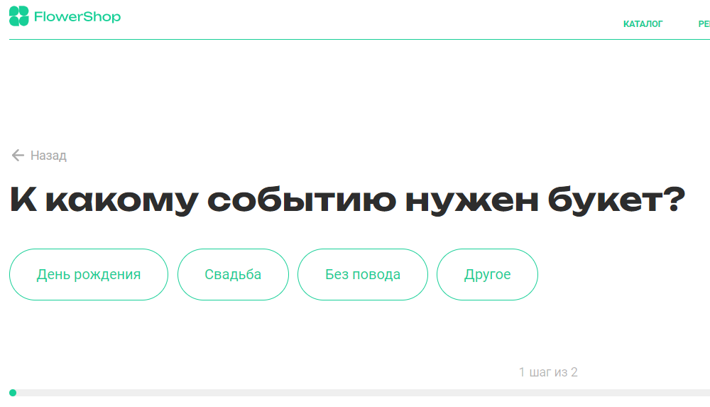
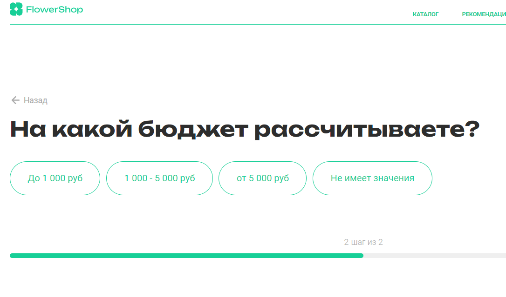
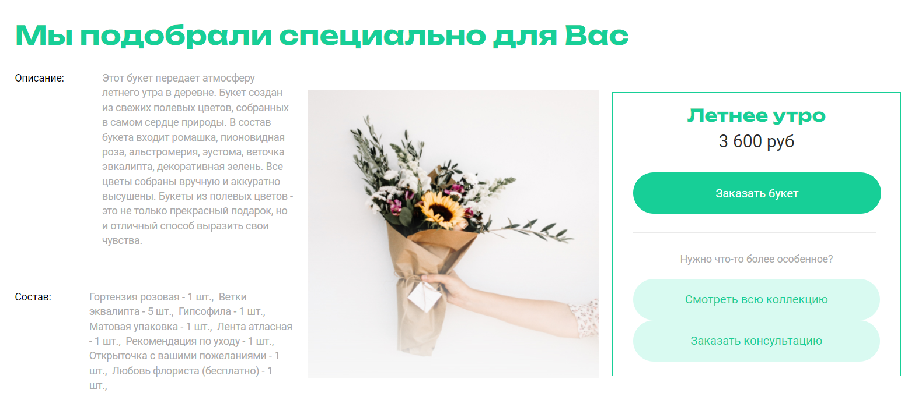
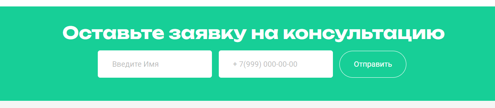
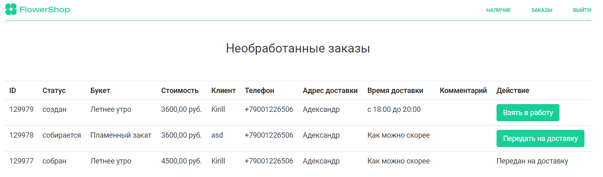

# Сайт цветочных мастерских FlowerShop

Это сайт цветочных мастерских FlowerShop.

Через сайт возможно ознакомиться со списком продающихся букетов.


Подобрать букет по паре вопросов.





Записаться на консультацию.



Ознакомиться со статистикой продаж менеджеру (дашборд)


Флористу взять заказы



На сайте есть три независимых интерфейса.

Первый — это публичная часть, где заказать букет и записаться на консультацию.

Второй — это авторизованная зона, где флористы могут взять заказ в работу и передать в доставку, а также менеджер может посмотреть статистику продаж.

Третий интерфейс это админка. Преимущественно им пользуются программисты при разработке сайта. Также сюда заходит
администратор, чтобы добавить мастерскую, букеты и новые поводы для буктов.

## Как запустить dev-версию сайта

Скачайте код.

Перейдите в каталог проекта:

```sh
cd FlowerShop
```

[Установите Python](https://www.python.org/), если этого ещё не сделали.

Проверьте, что `python` установлен и корректно настроен. Запустите его в командной строке:

```sh
python --version
```

Возможно, вместо команды `python` здесь и в остальных инструкциях этого README придётся использовать `python3`. Зависит
это от операционной системы и от того, установлен ли у вас Python старой второй версии.

В каталоге проекта создайте виртуальное окружение:

```sh
python -m venv venv
```

Активируйте его. На разных операционных системах это делается разными командами:

- Windows: `.\venv\Scripts\activate`
- MacOS/Linux: `source venv/bin/activate`

Установите зависимости в виртуальное окружение:

```sh
pip install -r requirements.txt
```

Определите переменные окружения:

- `DJANGO_SECRET_KEY` — секретный ключ проекта. Он отвечает за шифрование на сайте. Например, им зашифрованы все пароли на
  вашем сайте.
- `LINK_PAY` — секретный ключ для интеграции с банковским сервисом [ArsenalPay](https://arsenalpay.ru/).
- `DEBUG` — ОПЦИОНАЛЬНО, дебаг-режим. Поставьте `False` или `True`.
- `ALLOWED_HOSTS` —
  ОПЦИОНАЛЬНО, [см. документацию Django](https://docs.djangoproject.com/en/3.1/ref/settings/#allowed-hosts)
  Создать файл `.env` в каталоге `beauty_city/` и положите туда такой код:

```sh
SECRET_KEY=django-insecure-0if40nf4nf93n4
LINK_PAY=https://arsenalpay.ru/widget.html?widget=12345&destination=67890&amount=
```

Создайте файл базы данных SQLite и отмигрируйте её следующей командой:

```sh
python manage.py migrate
```

Запустите сервер:

```sh
python manage.py runserver
```

Откройте сайт в браузере по адресу [http://127.0.0.1:8000/](http://127.0.0.1:8000/).

## Администрирование

### Новый букет

1. Создайте букет в модели "Букеты", [относительный адрес /admin/flowerapp/bouquet/add/](/admin/flowerapp/bouquet/add/)
2. При создании вам потребуются также поводы, которым удовлетворяет букет, создать из можно там же 
3. При создании вам потребуются также состав букета, элементы состава также можно создать там же

### Тестовые заказы
Для того чтобы посмотреть, как работает статистика продаж (дашборд) на больших данных возможно вы захотите добавить
несколько десятков тысяч заказов, сделать это можно специальной командой
```sh
python manage.py create_test_orders
```

Удалить из можно по команде
```sh
python manage.py delete_test_orders
```

### Обновить карту салонов
1. Использовать сервис [Яндекс.Карты конструктов](https://yandex.ru/map-constructor/)
2. Добавить точки салонов на карты
3. Сохранить карту в размере 398*316px
4. Нажать на кнопку получения кода карты
5. Копировать код Javascript (пример: `<script type="text/javascript" charset="utf-8" async src="https://api-maps.yandex.ru/services/constructor/1.0/js/?um=constructor%3A91ac97307ed4da51b60dec5a82d971fc454cc9c30bc89b885820d3ddcf9c86a8&amp;width=398&amp;height=316&amp;lang=ru_RU&amp;scroll=true"></script>`)
6. Вставить в базовый шаблон html

## Список требуемых улучшений/исправлений

1. Связь букетов с салонами красоты
2. Интерфейс менеджера с возможностью назначение флористов/курьеров в салоны и просмотром их показателей
3. Добавление консультаций в интерфейс флориста
4. Расширение интерфейса флориста до интерфейса флориста и курьера, чтобы курьеры там же могли отмечать заказы
5. Добавление личного кабинета пользователя, где он может посмотреть свои заказы и консультации
6. Добавление поддержке адресов и расчета расстояния до доставки
7. Автоматическое выбор мастерской по адресу доставки и назначение заказов флористам/курьерам
8. Если рекомендованных букетов больше 3, то на главной будет карусель

## Цели проекта

Код написан в учебных целях — это командный проект в курсе по Python и веб-разработке на
сайте [Devman](https://dvmn.org).